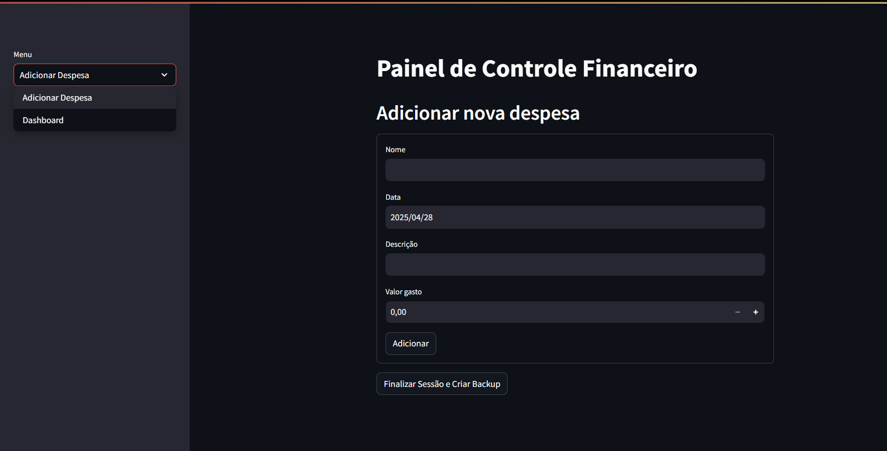
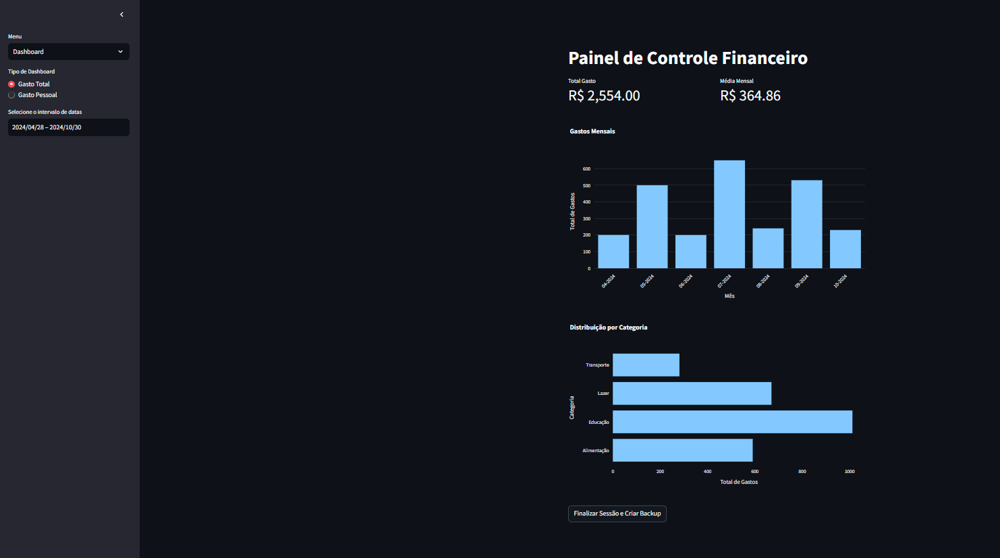
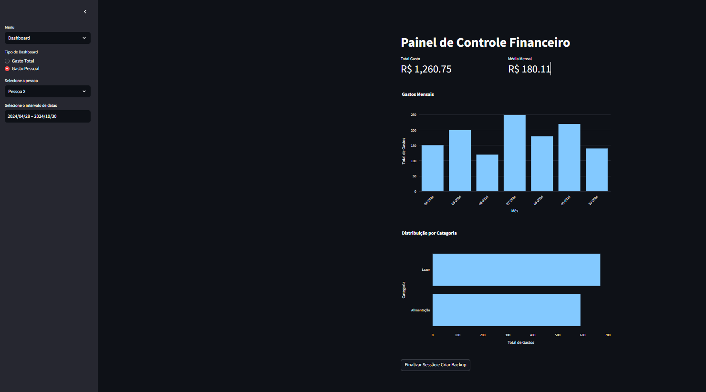
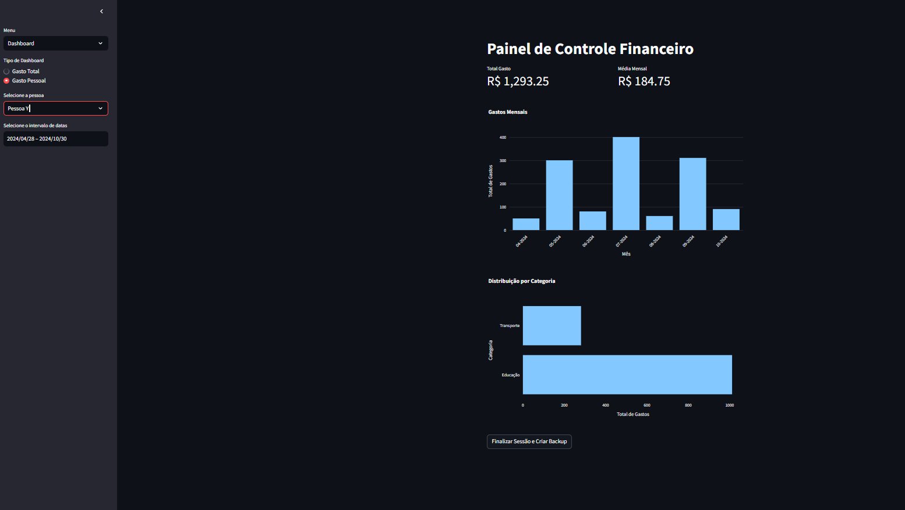

# Controle Financeiro Pessoal

Este projeto é um aplicativo simples de controle financeiro pessoal desenvolvido com Streamlit. Ele permite que o usuário registre despesas, visualize análises mensais e distribuições por categoria, além de gerar backups dos dados.

## Funcionalidades

- Adicionar despesas com informações de data, descrição, valor e nome da pessoa que realizou o gasto.
- Visualizar dashboard interativo com:
  - Gráfico de barras dos gastos mensais.
  - Gráfico de barras horizontal da distribuição por categoria.
  - Indicadores de total gasto e média mensal.
- Filtrar despesas por pessoa e intervalo de datas.
- Criar backup dos dados manualmente.

## Tecnologias Utilizadas

- Python 3.7+
- Streamlit
- Pandas
- Plotly Express

## Como Usar

1. Clone o repositório:

   ```bash
   git clone https://github.com/DevGuixavier/personal-finance-control.git
   ```

2. Navegue até o diretório do projeto:

   ```bash
   cd personal-finance-control
   ```

3. (Opcional) Crie e ative um ambiente virtual:

   ```bash
   python -m venv venv
   source venv/bin/activate  # Linux/macOS
   venv\Scripts\activate    # Windows
   ```

4. Instale as dependências:

   ```bash
   pip install -r requirements.txt

5. Execute o aplicativo:

   ```bash
   streamlit run app.py
   ```

6. Utilize a interface interativa para adicionar despesas, aplicar filtros e visualizar as análises em tempo real.

## Estrutura do Projeto

- `app.py`: Arquivo principal com a interface Streamlit.
- `data.py`: Manipulação de dados, armazenamento e backup.
- `analysis.py`: Funções para análise e visualização dos dados.
- `gastos.csv`: Arquivo CSV onde os dados são armazenados.
- `backups/`: Pasta onde os backups são salvos.
- `images/`: Pasta contendo imagens ilustrativas da aplicação.

## Demonstração

### Tela de Adicionar Despesa
Interface simples para inserir uma nova despesa com nome, data, descrição e valor.




### Dashboard - Gasto Total
Painel que exibe os gastos totais por mês e distribuição por categorias.




### Dashboard - Gasto por Pessoa (Pessoa X e Pessoa Y)
Visualização filtrada dos gastos para as pessoas fictícias Pessoa X e Pessoa Y.

#### Gasto Pessoa X




#### Gasto Pessoa Y



## Observações

- O arquivo `gastos.csv` e a pasta `backups/` estão no `.gitignore` para evitar versionamento de dados sensíveis.
- O projeto é modular e pode ser facilmente expandido com novas funcionalidades.
- Certifique-se de criar backups regularmente para evitar perda de dados.

## Contato

Para dúvidas ou sugestões, entre em contato:
- **GitHub**: [DevGuixavier](https://github.com/DevGuixavier)
- **LinkedIn**: [Guilherme Anjos Xavier](https://www.linkedin.com/in/guilherme-anjos-xavier/)
---

Este projeto foi criado para oferecer uma solução prática e eficiente de controle financeiro pessoal, com foco em simplicidade e visualização intuitiva.

